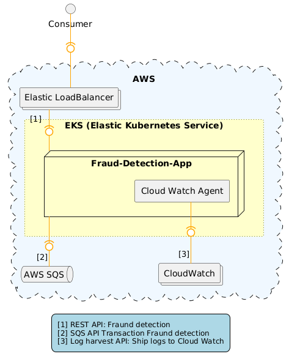

# Project Description
* This a real-time fraud detection system implementation Java.
* It can be deployed on a Kubernetes (K8s) cluster on a cloud platform (AWS/GCP/AII), 
* It is capable of detecting and handling fraudulent transactions swiftly and accurately.

# Design Notes




## SQS Listener
* One problem in the original implementation that the accessing of SQS is based on the annotation `@SqsListener` provided by spring-cloud-aws-sqs.
  But the implementation requiring the AWS SQS service shall be ready when this spring-boot application startup. During test, it will be failed the spring-boot start up due to it is implemented as bean and handled
  by BeanPostProcessor. If it is set by `@Lazy` the spring-boot can be launched but the message polling is dysfunctional and the component test is failed.
  Here an implementation with backoff re-connect mechanism is proposed, it would make it more robust in connectivity.

## Health Check
* The fraud-detection application supports readiness probe and liveness probe. The probe checks the connectivity between AWS SQS.

## Log
* In cloud-native, the logs are harvested and shipped to central logging system (e.g. Elasticsearch, Opensearch, Splunk or AWS cloudwatch).
  * The recommended solution is to implement the log shipper by non-intrusive solution, e.g. by Fluent Bit or CloudWatch Agent.
Below is a configuration example cloudwatch-agent-config.json for the CloudWatch Agent.
```json
{
  "logs": {
    "logs_collected": {
      "files": {
        "collect_list": [
          {
            "file_path": "/var/log/fraud-detection/server.log",
            "log_group_name": "fraud-detection-app-logs",
            "log_stream_name": "application"
          }
        ]
      }
    }
  }
}
```

# LeftOver
* As time limit, the detection rules now is implemented in spring-boot's application properties.
  It can be extended to configMap and be rendered to environment variables or mounted file for fraud detection application.
  Even more, it can be configured in central configuration management for production-grade system.

# Build
## Build Environment Setup
* This project is based on JDK17 and maven 3.5.4, please download SDKs from below links.
  - https://download.java.net/java/GA/jdk17.0.2/dfd4a8d0985749f896bed50d7138ee7f/8/GPL/openjdk-17.0.2_linux-x64_bin.tar.gz
  - https://archive.apache.org/dist/maven/maven-3/3.5.4/binaries/apache-maven-3.5.4-bin.tar.gz

## Test Summary
* This project is a spring-boot project, yuo can start up the spring-boot application locally by IDE (e.g. intellij).
  - `curl http://localhost:8080/actuator/health`
  - `curl -i -X POST -d @data.json -H 'Content-Type:application/json' http://localhost:8080/api/v1/fraud-detection/analyze`
* This project has both Unit Test andComponent Test by Cucumber.
  - run component test by `mvn test -f fraud-detection-ct/pom.xml -Dtest=FraudDetectionTest -Djacoco.classifier=jacoco -Dcucumber.filter.tags=@fraud-detection`.
  - The component test utilizes the testcontainer to simulate the AWS SQS by LocalStack.
  - Special requirement for Windows user when running test.
  - WSL with docker daemon installation.
  - Expose docker port (cleartext) for remote connection.
    ```shell
    sudo mkdir -p /etc/systemd/system/docker.service.d
    sudo vim /etc/systemd/system/docker.service.d/override.conf
    
    # add the below to the override.conf file
    [Service]
    ExecStart=
    ExecStart=/usr/bin/dockerd --host=tcp://0.0.0.0:2375 --host=unix:///var/run/docker.sock
    ```
  - Restart docker daemon and Verify Port is Exposed
    ```shell
    sudo systemctl daemon-reload and then sudo systemctl restart docker or sudo service docker restart
    root@xxxxxx:/etc/docker# netstat -nl | grep 2375
    tcp6       0      0 :::2375                 :::*                    LISTEN
    ```
  - Environment Variables: 
    - export DOCKER_HOST=tcp://<virtual_machine_host>:2375 
    - export DOCKER_TLS_VERIFY=0
    - The virtual_machine_host can be got the output of "ifconfig" in WSL. It cannot be configured as localhost or 127.0.0.1 after testcontainers v1.18.x+.
    - The priority of environment variables is higher than the file configuration.
    - You can configure the Windows environment variable in IDEA.

  
    
  - Access container address in Windows
    When running test cases, we sometimes need to access the address of the remote container, such as redis-cluster. At this time, we need to create routing rules in Windows PowerShell by **running as administrator**.
    - `route -p add $container_network MASK $Subnet_mask $virtual_machine_host` 
      + for example: route -p add 172.17.0.0 MASK 255.255.255.0 172.31.1.23

  - Testcontainers Custom configuration: Refer to this connection: https://www.testcontainers.org/features/configuration/

## Build Artifacts
* `export JAVA_HOME=<yourJDK17Path>;echo $JAVA_HOME`
* `mvn clean package`
* `mvn clean package -pl \!fraud-detection-ct` if you want to skip the component test.

# Deploy
* This project provides handy helm chart to deploy it into Kubernetes cluster or public cloud platform.
* The docker image is already uploaded to duckerhub as kasperdeng/fraud-detection:latest. You can build it in local development environment.
  - `docker build -t <imageName>:<tag>`
* helm installation or uninstallation
  - `helm install -f values.yaml <helm-release-name> ./helm-chart -n <namespace>`
  - The service type now default is LoadBalancer, it depends on the loadBalancer capability provided by cloud platform or On-premises cloud platform (e.g. metalLB). You can change the nodeType to nodePort for manual test.
  - `helm uninstall <helm-release-name> -n <namespace>`
