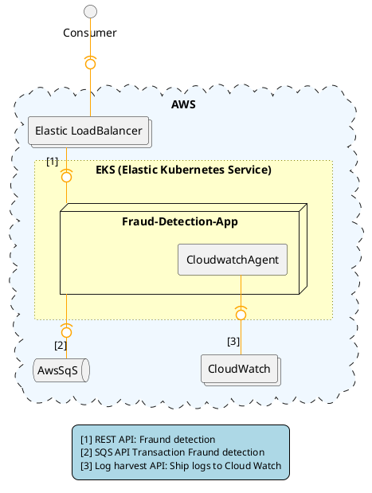
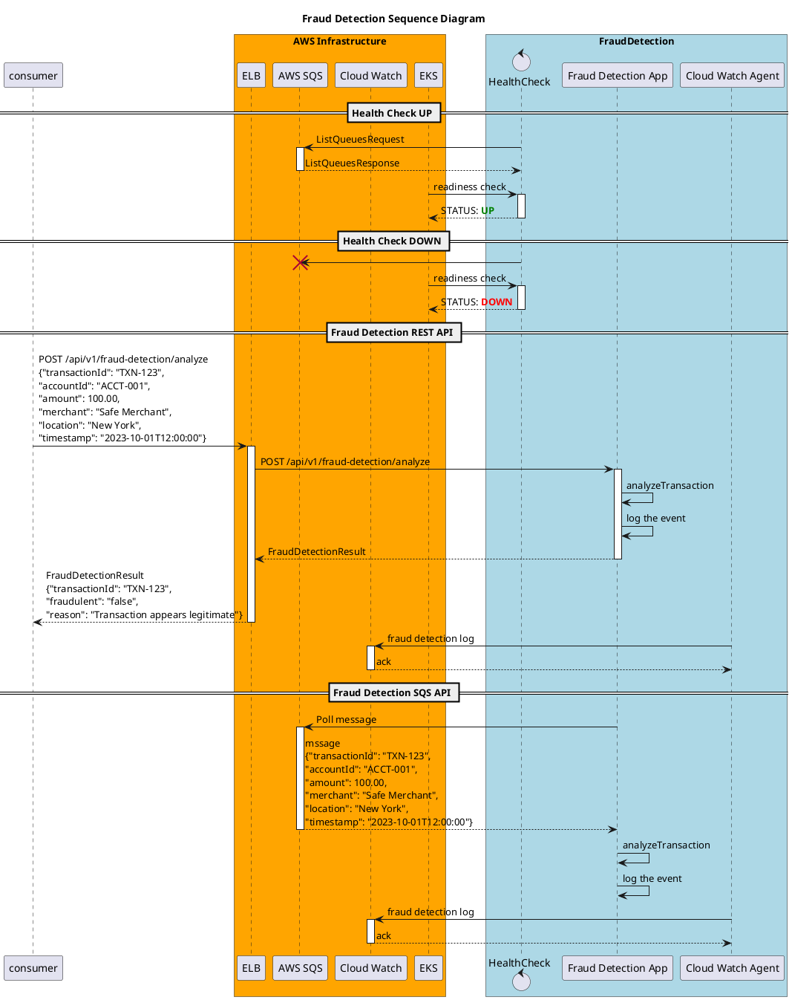

```plantuml
@startuml

<style>
  legend {
    FontSize 12
    BackGroundColor lightblue
    Margin 10
    Padding 10
  }
</style>

skinparam linetype ortho

skinparam nodesep 140
skinparam ranksep 100

cloud AWS #aliceblue;line.dashed {
  queue AwsSqS
  collections "Elastic LoadBalancer" as ELB
  collections CloudWatch
  rectangle "EKS (Elastic Kubernetes Service)" #Business;line:Olive;line.dotted {
    node "Fraud-Detection-App" as FD {
      agent "CloudwatchAgent" as cloudAgent
    }
  }
}

Consumer -[#orange](0- ELB
ELB "[1]" -[#orange](0- FD
FD -[#orange](0- "[2]" AwsSqS
cloudAgent -[#orange](0- "[3]" CloudWatch

legend
[1] REST API: Fraund detection
[2] SQS API Transaction Fraund detection
[3] Log harvest API: Ship logs to Cloud Watch
end legend

@enduml
```

```plantuml
@startuml

title Fraud Detection Sequence Diagram

participant consumer

box "AWS Infrastructure" #Orange
  participant ELB
  participant "AWS SQS" as sqs
  participant "Cloud Watch" as cw
  participant EKS
end box

box "FraudDetection" #LightBlue
  control "HealthCheck" as hc
  participant "Fraud Detection App" as fd
  participant "Cloud Watch Agent" as cwa
end box

== Health Check UP ==
hc -> sqs++: ListQueuesRequest
hc <-- sqs--: ListQueuesResponse
EKS -> hc++: readiness check
EKS <-- hc--: STATUS: <b><color:#green>UP</b>

== Health Check DOWN ==
hc -> sqs !!
EKS -> hc++: readiness check
EKS <-- hc--: STATUS: <b><color:#red>DOWN</b>

== Fraud Detection REST API ==
consumer -> ELB++: POST /api/v1/fraud-detection/analyze\n{"transactionId": "TXN-123",\n"accountId": "ACCT-001", \n"amount": 100.00,\n"merchant": "Safe Merchant",\n"location": "New York",\n"timestamp": "2023-10-01T12:00:00"} 
ELB -> fd++: POST /api/v1/fraud-detection/analyze
fd -> fd: analyzeTransaction
fd -> fd: log the event
ELB <-- fd--: FraudDetectionResult
consumer <-- ELB--: FraudDetectionResult\n{"transactionId": "TXN-123",\n"fraudulent": "false",\n"reason": "Transaction appears legitimate"}
cwa -> cw++: fraud detection log
cwa <-- cw--: ack

== Fraud Detection SQS API ==
fd -> sqs++: Poll message
fd <-- sqs--: mssage\n{"transactionId": "TXN-123",\n"accountId": "ACCT-001", \n"amount": 100.00,\n"merchant": "Safe Merchant",\n"location": "New York",\n"timestamp": "2023-10-01T12:00:00"}
fd -> fd: analyzeTransaction
fd -> fd: log the event
cwa -> cw++: fraud detection log
cwa <-- cw--: ack

@enduml
```